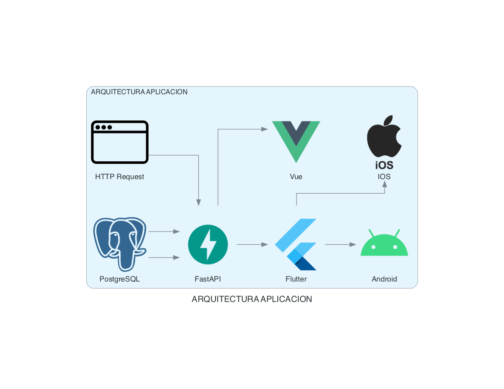

# Documentation_IT

## Descripción

Este repositorio contiene documentación relacionada con la infraestructura de TI, diseñada para facilitar el uso y la creación de diagramas en proyectos de infraestructura. Está orientado a proporcionar recursos de documentación que pueden ser utilizados en diversos entornos de desarrollo e implementación.

## Licencia

Este proyecto está bajo la licencia [MIT](LICENSE).

## Instalación

### Usando pip

Si prefieres usar `pip`, puedes instalar las dependencias necesarias con el siguiente comando:

```bash
$ pip install diagrams

```


### Usando pipenv
Si utilizas pipenv para gestionar tus entornos virtuales, puedes instalar las dependencias de esta manera:

```bash
$ pipenv install diagrams
```

Usando Poetry
Si prefieres usar Poetry para gestionar tus entornos virtuales, puedes instalar las dependencias de esta manera:

```bash
$ poetry add diagrams
``` 


