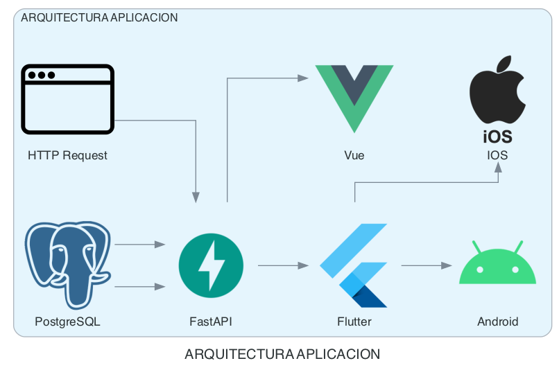

# Documentation_IT

## Description

This repository contains documentation related to IT infrastructure, designed to facilitate the use and creation of diagrams in infrastructure projects. It is aimed at providing documentation resources that can be used in various development and deployment environments.

## License

This project is licensed under the [MIT License](LICENSE).

## Installation

### Using pip

If you prefer to use `pip`, you can install the necessary dependencies with the following command:

```bash
$ pip install diagrams
```

### Using pipenv

If you use pipenv to manage your virtual environments, you can install the dependencies like this:

```bash
$ pipenv install diagrams
```

### Using Poetry

If you prefer to use Poetry to manage your virtual environments, you can install the dependencies like this:

```bash
$ poetry add diagrams
```

## Application Architecture Diagram

